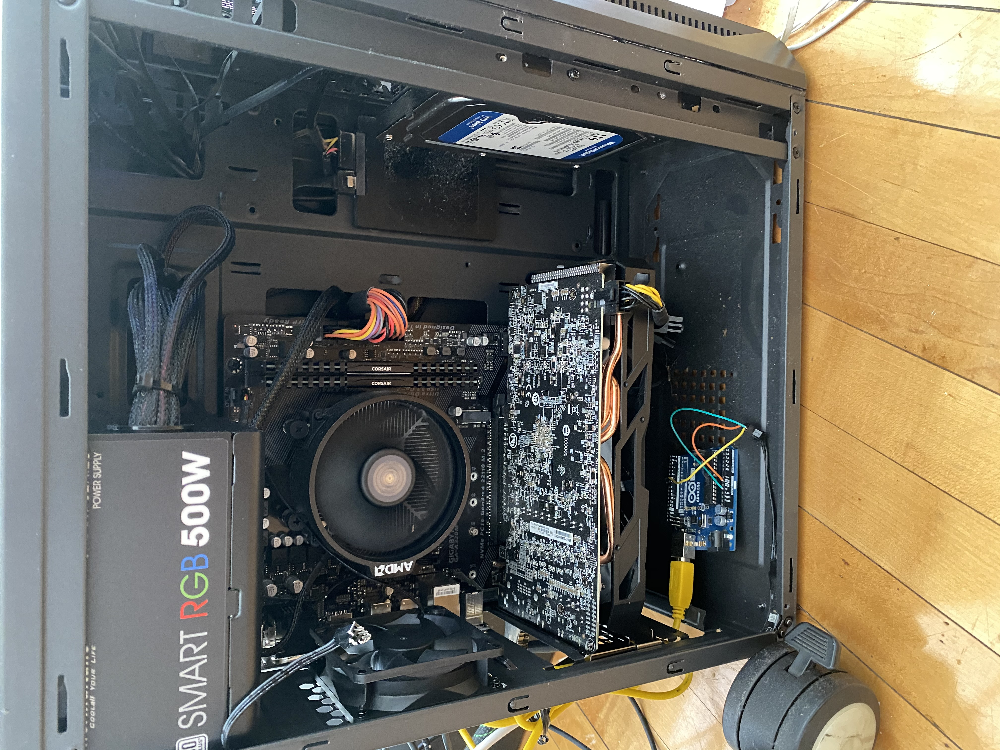
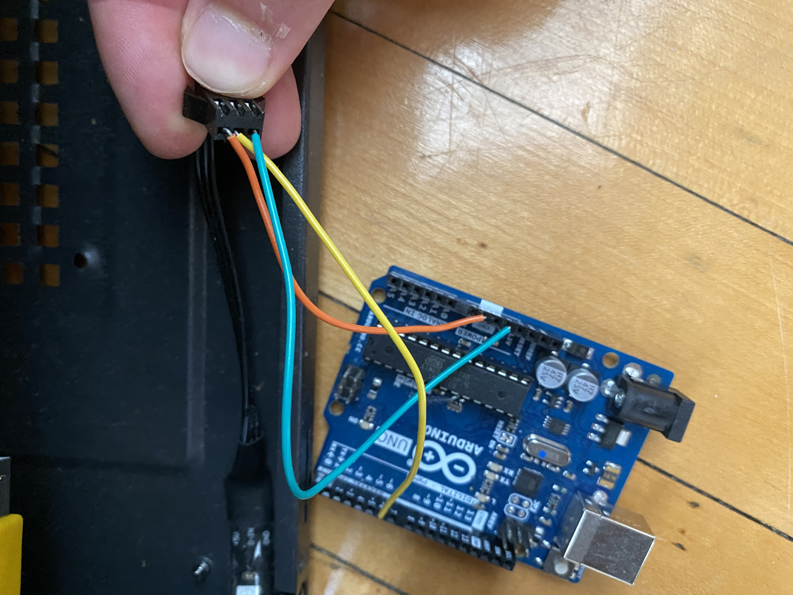
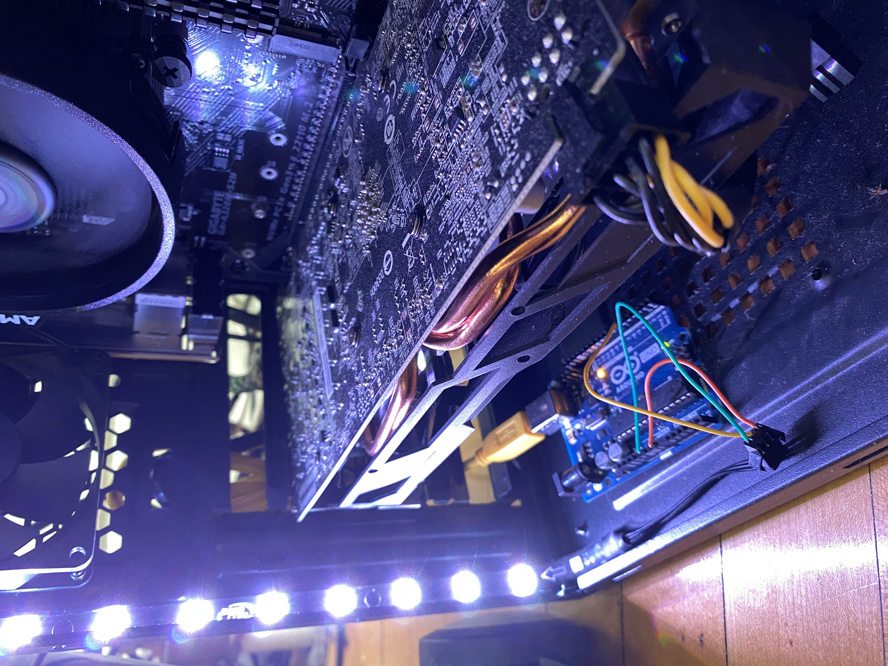

# Arduino-LED-Controller

After building my first computer, I was faced with a minor issue. The inner well of my desktop tower was
covered by a tinted glass panel but it was difficult to see inside. Even with the panel removed, the inside
was very dark. I decided to buy led strips online and connect the adapter to the digital output 
slots on the arduino UNO. I then wrote a script that allowed me to control the RGB values of the strip 
using the FASTLED library. Values can be changed by altering the RGB ranges (0-255) of the led[i] variable.

.jpg)

I currently have it set to CRGB(255,255,255) which is the sum of all colors which of course is white. 

